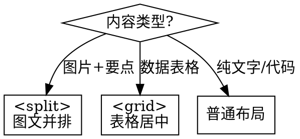

# Markdown to Advanced Slides Converter

将 Markdown 转换为 Obsidian Advanced Slides 演示文稿，支持多种汇报类型，生成演讲者笔记和时间预算。

## Constants

| 参数 | 默认值 | 说明 |
|------|--------|------|
| `PRESENTATION_TYPE` | `standard` | `daily`(3-5min) / `weekly`(5-10min) / `standard`(10-15min) / `quarterly`(15-20min) / `annual`(20-30min) |
| `OUTPUT_DIR` | `10-Advanced Slides/` | 输出目录 |
| `THEME` | `default` | 主题颜色 |

## When to Use

- 周报/月报转为演示文稿 (`daily`/`weekly`)
- 项目进展汇报 (`standard`)
- 季度/年度汇报 (`quarterly`/`annual`)
- 技术分享/培训材料

## Presentation Type → Content Depth

| 类型 | 时长 | 幻灯片数 | 内容深度 |
|------|------|:--------:|----------|
| `daily` | 3-5 min | 3-5 | 问题 + 1 结果 + 下一步 |
| `weekly` | 5-10 min | 5-8 | 进展 + 关键成果 + 计划 |
| `standard` | 10-15 min | 8-12 | 完整故事：动机-方法-结果-总结 |
| `quarterly` | 15-20 min | 12-18 | 详细：背景-方法-实验-分析-计划 |
| `annual` | 20-30 min | 18-25 | 全面：回顾-成果-分析-展望 |

## Presentation Rules

| 规则 | 说明 |
|------|------|
| **一页一信息** | 如果一张幻灯片有两个主题，拆分为两张 |
| **最大 6 行** | 每张幻灯片不超过 6 个要点 |
| **最大 8 字/行** | 每行不超过 8 个词（中文约 12 字） |
| **关键数字加粗** | "效率提升 **100x**" |
| **图片 ≥60%** | 图片类幻灯片，图片占主要面积 |

## Core Syntax

### 幻灯片分隔

| 分隔符 | 用途 |
|--------|------|
| `---` | 水平幻灯片（主章节） |
| `--` | 垂直幻灯片（子章节展开） |

### 注释语法

```markdown
<!-- 幻灯片样式 -->
<!-- .slide: style="background: #2d3436; color: white;" -->

<!-- 元素动画 -->
+ 第一点    # 逐步显示
+ 第二点

<!-- 演讲者备注 -->
note:
[时间: 1.5 min]
演讲内容要点...
→ 过渡: "接下来介绍..."
```

## Conversion Workflow

### Phase 1: Analyze & Plan

1. **识别文档类型**：从标题/frontmatter 判断汇报类型
2. **估算时间**：根据 `PRESENTATION_TYPE` 确定时长
3. **规划结构**：生成幻灯片大纲

**输出**: `SLIDE_OUTLINE.md`

```
📊 演示大纲:
- 类型: quarterly (15-20 min)
- 幻灯片: 14 张
- 结构:
  1. 封面 [0:30]
  2. 项目背景 [2:00]
  3. 技术方案 [4:00]
  4. 实验结果 [5:00]
  5. 下一步计划 [2:00]
  6. 总结 [1:30]
```

### Phase 2: Convert Content

**标题层级映射**:

| 原层级 | 转换 |
|--------|------|
| `# H1` | 封面页，居中 |
| `## H2` | 水平幻灯片 `---` |
| `### H3` | 垂直幻灯片 `--` |
| `#### H4+` | 内容，保持 |

**内容转换**:

| 类型 | 规则 |
|------|------|
| 列表 | `-` → `+` (动画) |
| 表格 | 居中 `<grid>` |
| 图片+文字 | `<split>` 两栏 |
| 公式 | 保持 `$$...$$` |
| 代码块 | 保持，无动画 |

### Phase 3: Add Speaker Notes

每张幻灯片添加 `note:` 包含：

```markdown
note:
[时间: 1.5 min]
1. 开场白/过渡语
2. 核心要点 (2-3 个)
3. 过渡到下一页
```

**模板示例**:

```markdown
## 技术方案

note:
[时间: 2 min]
"接下来介绍我们的技术方案..."
核心要点:
- 四阶段流程的设计思路
- 每个阶段的关键技术
→ 过渡: "具体效果如何？让我们看实验结果..."
```

### Phase 4: Quality Check

验证清单：
- [ ] 每张幻灯片 ≤ 6 行
- [ ] 每行 ≤ 8 词
- [ ] 图片幻灯片图片 ≥60%
- [ ] 每张幻灯片有 `note:`
- [ ] 时间预算总和 ≈ 目标时长

## Output Files

```
10-Advanced Slides/
├── {filename}-slides.md    # 演示文稿
├── {filename}-outline.md   # 大纲 (可选)
└── {filename}-qa.md        # Q&A 预测 (quarterly/annual)
```

## Templates by Type

### Daily Report (3-5 min)

```markdown
---
theme: default
paginate: true
---

<!-- .slide: style="text-align: center;" -->

# 今日进展

**日期** | **项目**

---

## 完成事项

+ 任务 1
+ 任务 2

---

## 问题与求助

+ 问题 1

---

<!-- .slide: style="text-align: center;" -->

## 明日计划

+ 计划 1
+ 计划 2
```

### Weekly Report (5-10 min)

```markdown
---
theme: default
paginate: true
---

<!-- .slide: style="text-align: center;" -->

# 周报：{项目名}

**周次** | **汇报人**

---

## 本周进展

--

### 完成事项

+ 事项 1
+ 事项 2

--

### 关键成果

![[result.png|400]]

成果说明...

---

## 问题与风险

+ 问题 1: 描述与解决方案

---

## 下周计划

+ 计划 1
+ 计划 2
```

### Quarterly Review (15-20 min)

```markdown
---
theme: default
paginate: true
size: 16:9
---

<!-- .slide: style="text-align: center;" -->

# 季度汇报：{项目名}

**Q1 2026** | **汇报人**

note:
[时间: 0:30]
感谢各位参加本次季度汇报...
→ 过渡: "首先回顾项目背景..."

---

## 目录

+ 项目背景
+ 技术方案
+ 实验结果
+ 下一步计划
+ 总结

note:
[时间: 0:30]
本次汇报分为五个部分...

---

## 项目背景

note:
[时间: 2:00]
"首先介绍项目背景..."

--

### 研究目标

+ 目标 1
+ 目标 2

note:
[时间: 1:00]
核心目标是...

--

### 核心创新

+ 创新点 1
+ 创新点 2

note:
[时间: 1:00]
我们的创新在于...

---

## 实验结果

note:
[时间: 2:00]
"接下来展示实验结果..."

--

### 性能对比

<grid drag="90 70" drop="center">
| 方法 | 指标 |
|------|------|
| 基线 | X |
| **本方法** | **Y** |
</grid>

note:
[时间: 1:00]
关键发现是...

---

<!-- .slide: style="text-align: center;" -->

## 总结

+ 成果 1
+ 成果 2
+ 成果 3

**下一步：{关键行动}**

note:
[时间: 1:30]
总结一下，我们实现了...
→ 过渡: "欢迎提问..."
```

## Q&A Generation

对于 `quarterly` 和 `annual` 类型，生成预期问答：

```markdown
# Q&A 预测

## Q1: 为什么选择这个技术路线？
**A**: 基于 [原因]，我们选择 [方案]，相比 [替代方案] 有 [优势]。

## Q2: 主要风险是什么？
**A**: 当前主要风险是 [风险]，我们计划通过 [措施] 缓解。

## Q3: 需要什么支持？
**A**: 需要 [资源/支持]，用于 [目的]。

## Q4: 下阶段里程碑？
**A**: Q2 目标是 [目标]，关键节点是 [时间点]。
```

## Layout Decision



## Red Flags

**禁止使用的错误语法**:

| 错误 | 正确 |
|------|------|
| `<!-- slide: cover -->` | `<!-- .slide: style="text-align: center;" -->` |
| `<!-- _class: lead -->` | `<!-- element class="..." -->` |
| `<!-- note -->内容<!-- -->` | `note: 内容` |
| 无时间预算的 `note:` | `note:\n[时间: X min]\n...` |

## Example Transformation

**输入**:

```markdown
## 技术方案

### 核心技术

- 技术 1
- 技术 2
```

**输出**:

```markdown
---

## 技术方案

note:
[时间: 2 min]
"接下来介绍技术方案..."
→ 过渡: "具体效果如何？"

--

### 核心技术

+ 技术 1
+ 技术 2

note:
[时间: 1 min]
核心要点是...
```